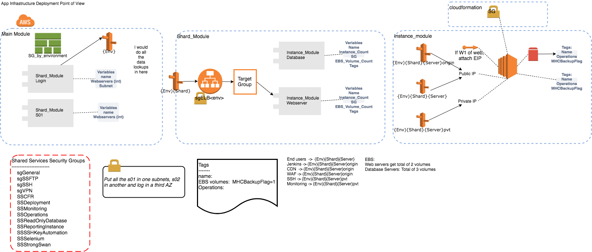

# MHC Infrastructure Automation

## What does this mean
|Environment|English|
|---|---|
|p|production|
|q{\l}|QA environment|
|pt|prodtest (mirror of prod software wise)|
|pc|precept test (precept is a customer QA)|
|s{\l}|staging environment|
|d{\l}|demo environment|
|d|developers environments|
|bscq{\l}|Blue Cross CA QA environment, these are connected to the same q{\l} location too|


## Architecture

Servers are named with a structure of `<env><shard><role>` where

    env    = qa|qb|cyb|p|d(emo)
    shard  = s01|s02|log(in)
    server = db1|w1|w2

Servers are distributed per subnet:

* cybs01w1, cybs01db1,  qbs01w1, qbs01db1
* cybs02w1, cybs02db1,  qbs02w1, qbs02db1
* cyblogw1, cybslogdb1, qblogw1, qblogdb1


### Security Groups

_Shared Services_ (SS)

By environment

    sg_by_environment.json

Deploy to `us-east-1`, then `us-west-2` (see Foghorn general How-To guide).

### Terraform

Terraform for an MHC application deploy lives in
`terraform/app_stack`. This terraform module is built around the idea
of a _shard_, which contains a web server instance, db instance, and
supporting components (Route 53 entries, EBS volumes, etc.).



## Usage

It is important (or at least easiest), to deploy a Login server first,
followed by shards (1, 2, etc.), since shards replicate their tables
to the login server (but not the other way around). Thus, it makes
sense to follow the outline describe here for `server=log`, then
`server=s01`, etcetera.

Deploying an application or adding a shard is a multi-step process. At
a high-level, the steps are:

1. Run the `app_stack` terraform
2. Add or update a file in `ansible/hosts/`
3. Run the `application` Ansible playbook
4. Run Jenkins against the new environment or shard [MHCDeploy-Temp](https://dev.mobilehealthconsumer.com/jenkins/job/MHCDeploy-Temp/)
5. Run the `post_jenkins` Ansible playbook

### Terraform

    terraform init -backend-config=backend_mhc.tfvars
    terraform plan -var-file=mhc.tfvars

See `terraform/app_stack/README.md` for more details.

### Ansible

#### Hosts, tags, and limits

    ansible-playbook -i ./hosts/cyb_hosts \
        --check --diff \
        ./application.yml

    ansible-playbook -i ./hosts/qb_hosts \
        --check --diff --tags timezone \
         ./application.yml

    ansible-playbook -i hosts/qa_hosts \
        --check --diff --limit qalog* \
        log_migration.yml

    ansible-playbook -i hosts/qa_hosts \
        --check --diff --limit qas02* \
        log_migration.yml

### Post-Jenkins playbook

After a new environment is created with Terraform, the `base_playbook.yml` should be run for Ansible to configure the servers. Then Jenkins must be run. After that, there's a final step, in `post_jenkins_setup.yml` which must be run via Ansible.

For reference, Jenkins is on `dev.mobilehealthconsumer.com`. If you need to test Jenkins' access, it's possible to ssh `bitnami@dev`, then `sudo su - jenkins` and try ssh to `ubuntu@<target>`.


### Testing new functionality with Docker

Before releasing new features into images, they must be tested.

#### One off infra testing instance

If you do need an instance for one off testing within the account. Follow these configs 

```
AMI ID (blank ubuntu 18 AMI)
 ami-074251216af698218
VPC ID
 vpc-0b10526e (MHCVPCv1) 
IAM Role
 none
Subnet ID
 subnet-d7ad06b3 (NonProduction-AZ1) 
```

#### Testing with ECR ansible-operations image

Login via terminal using:
`saml2aws login -a (your profile)`
Ensure that you have access by running a test list command:
`aws --profile mhc ecr --region us-west-2 describe-repositories' (don't forget region)
If you get a list of repositories returned, you are good to go. 

Ensure you have docker installed and started
`docker --version`
Ensure docker has been installed and is running:
`docker ps`
If docker is not running, install it on your gui.
`

From there, Retrieve an authentication token and authenticate your Docker client to your registry.
```aws --profile mhc ecr get-login-password --region us-west-2 | docker login --username AWS --password-stdin 913835907225.dkr.ecr.us-west-2.amazonaws.com
WARNING! Your password will be stored unencrypted in /Users/youruser/.docker/config.json.
Configure a credential helper to remove this warning. See
https://docs.docker.com/engine/reference/commandline/login/#credentials-store```

Now you should be able to pull down your ECR repository:
`docker pull 913835907225.dkr.ecr.us-west-2.amazonaws.com/operations-ansible:latest`

#### Before you're able to log in with the ansible operations server, ensure that you're config is setup for easy use:
I like to use an alias in my .zshrc file to keep things simple, something like this:

```
alias mhcansible='mhc && docker run --rm -it -e AWS_PROFILE=mhc -v /Users/youruser/code/.bash_history:/root/.bash_history -v /Users/youruser/.ssh/yourkey:/root/.ssh/youruser -v /Users/youruser/.ssh/known_hosts:/root/.ssh/known_hosts:ro -v /Users/youruser/.aws:/root/.aws -v /Users/youruser/code/yourrepo:/data --entrypoint /bin/bash yourERCimage:latest'
```
Once you have this alias, or something like it, you are now prepped and able to spin up the `operations ansible` container for use on your local machine.


### Monitoring and Alerting
Nagios is the primary monitroing and alerting tool for mhc. The majority of the alerts are for:
Free space, cpu utilization, AV warnings, DB Query times, etc.

These slack channels are integrated with Nagio and a custom foghorn alert called mc-alerts 

```mhc-alerts-nonprod
mhc-alerts
```


### One off automations and quirks:

#### Port forwarding
There is a systemd service, called mhc-portforwarding.service, which after being started (by ansible) will auto restart after failer or server reboot. This script acts as the ubuntu user to call out to it's env/shards respective db1 server to forward ports. 
`6379:localhost:6379 -R 5672:localhost:5672 -R 15672:localhost:15672 -R 25672:localhost:25672 -o ServerAliveInterval=60 -o ServerAliveCountMax=3 -f tail -f /dev/null`


### Regularly scheudled work
There is a monthly meeting to go over Scan results for Nessus scans. We have automation setup on a monthly basis to turn on a nessus server, run the scans, and then email the results to Matt and Justing. (This should be looked into sending to a distribution list) 

### Current outstanding issues
ClamAV has been using a lot of memory, chewing up all of th eswap on servers, and it causes alerts to go off. Justin's tried to set swap use to zero, and it still doesn't work. Foghorn will investigate.  (https://foghorn.atlassian.net/browse/CUSTMHC-801)

